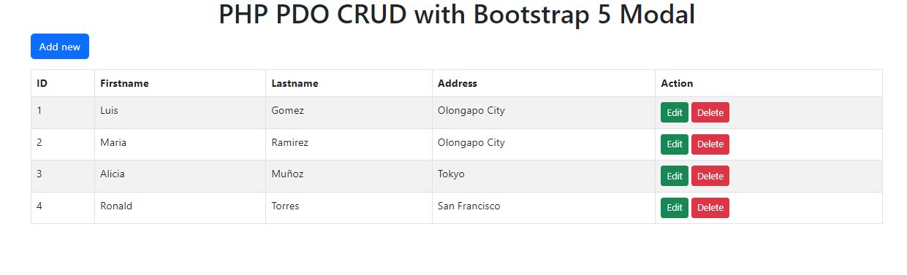
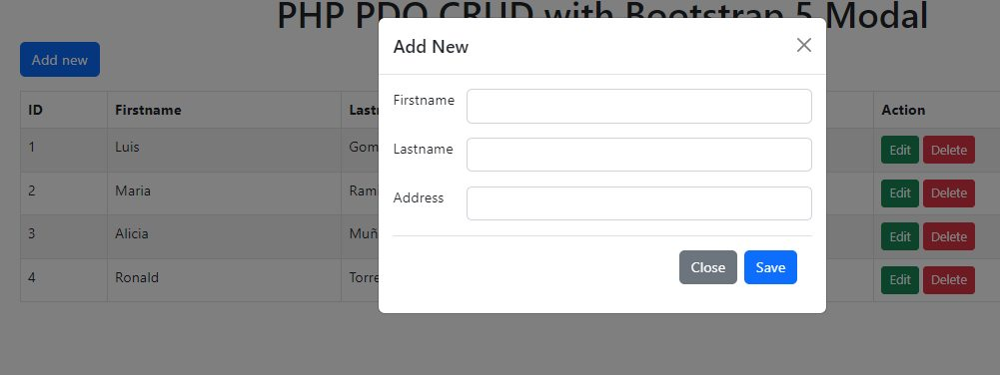
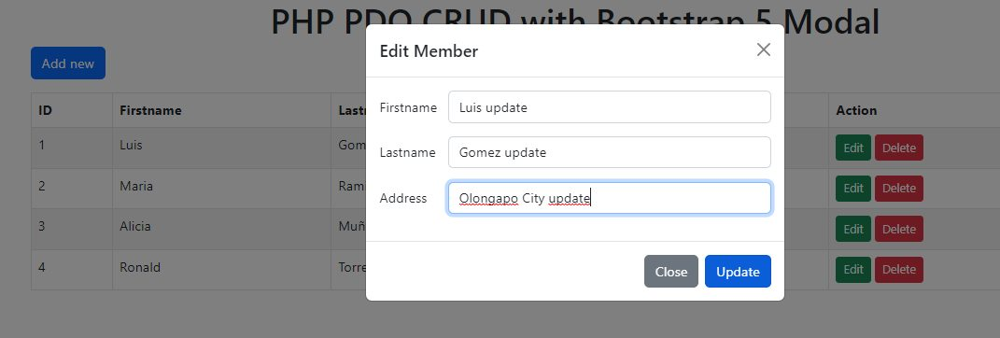
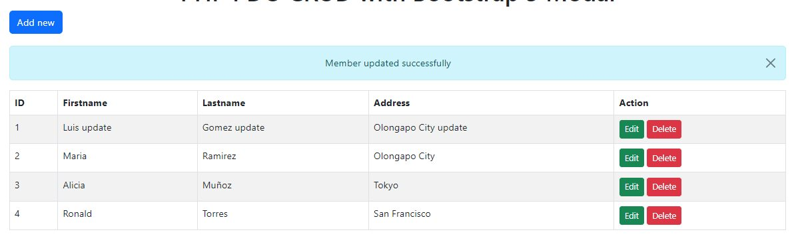
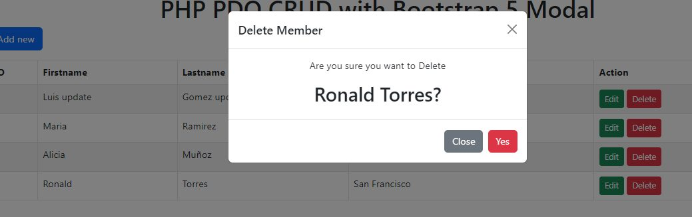

# CRUD PHP, MYSQL, PDO CLASS, BOOTSTRAP MODAL

CRUD de una sola tabla de miembros.

## TECH & TOOLS :wrench:

* Html
* Css
* PHP
* MYSQL
* Bootstrap
* Conexión CLASS PDO a base de datos
* Uso de modales de bootstrap

## SCREENSHOT

